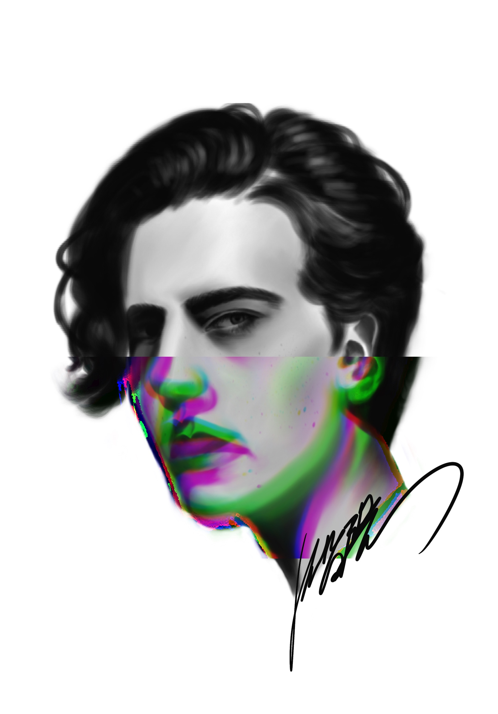

  I use the iPad app "Procreate" for painting. It can do pretty much of all the trick.

  <!-- Add your paintings here. For each painting, use this template: -->
  <!--
  

    
    
Title, Medium, Year

  

  -->

  

  
  
Just some doodling

  
  
Another doodling

<!--
  HOW TO ADD PAINTINGS:
  1. Add image files (jpg, png) to the /attic/ folder in your repo
  2. Copy a gallery-item block above for each painting
  3. Update the src, alt, and caption
  4. Push to GitHub — the site will rebuild automatically
-->
